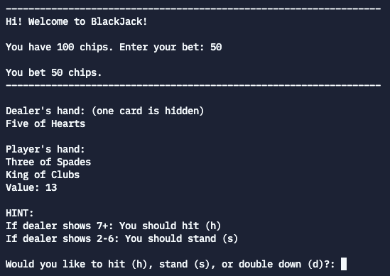

This is a text-based version of the card game blackjack I made for ICS 110 (introductory Python course). This was an individual project made in the [Replit](https://replit.com) IDE and Python. Along with normal BlackJack rules, there were a few special rules we had to follow:
 - Give the Player a hint according to the values of their cards and the Dealer
 - Ask the Player if they wish to Hit, Stand, Double Down or Split and take another card
 - If a Player Stands, play the Dealer's hand. The dealer will always Hit until the Dealer's value meets or exceeds 17
 - If the player Doubles Down which is doubling the original bet and receiving only one more card regardless of its denomination at this point you also need to turn the players original two cards faceup
 - If the player Splits (if the first two cards are of the same denomination) make a second bet equal to your first and split the pair, using each card as the first card in a separate hand

## What I learned and Improvements
As the first computer science class I ever took, this utilized the skills of logic and object-oriented programming I had learned. It was also my first experience with a "larger" project and writing a lot of code, as we had been doing small exercises up until this point. So it was a good experience to put it all together and actually make something.

Since this was created a long time ago, there are likely a lot of improvements I could make. For one thing, the chips are reset to 100 after each game, even if you choose to continue playing. This is because our instructor said to make it this way. However, this has little practical use and doesn't make much sense, so having the chips carry over is something I would change. Also, it is likely that the code is redundant in certain places, especially regarding the split option. Since I know better by now, I would try to make sure it followed better coding practices.
 
Source: <a href="https://github.com/KaileeHung/blackjack"><i class="large github icon"></i>KaileeHung/blackjack</a>

  
