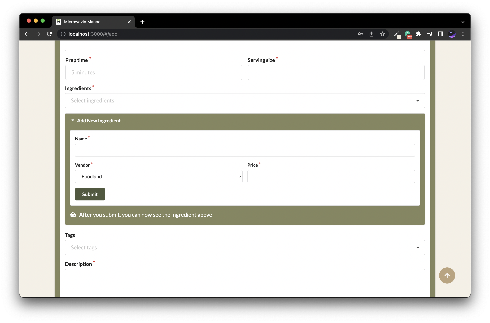
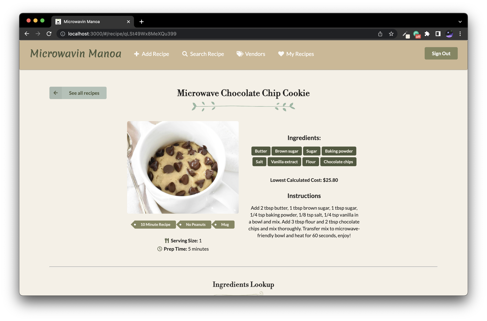
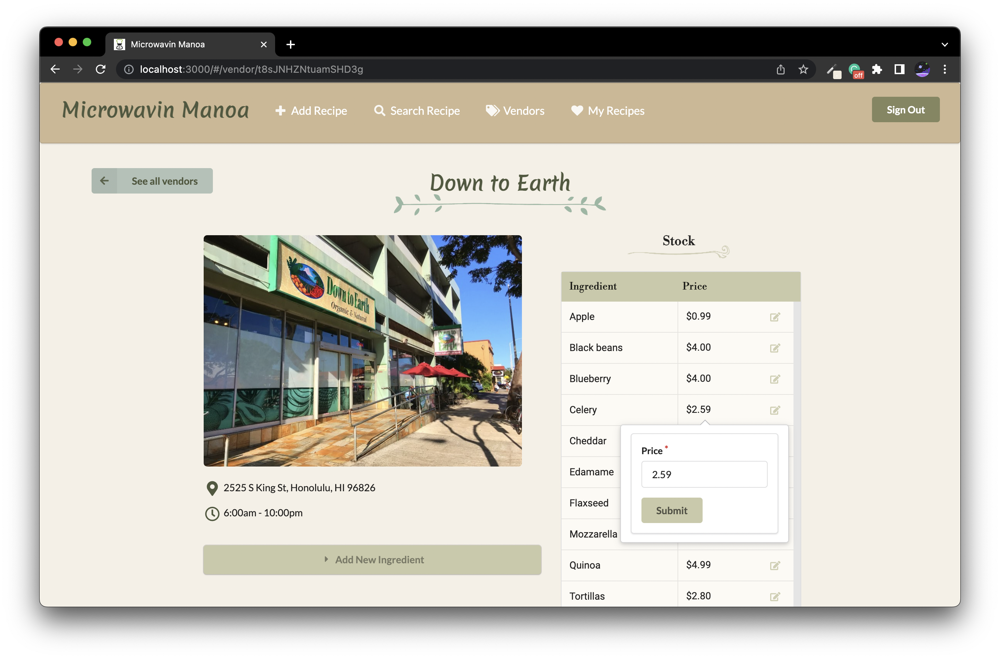

## Overview

To learn more, check out the **[Microwavin Manoa Project Page](https://microwavin-manoa.github.io/)**

Many college students have limited kitchen resources, limited cooking skills, limited time, limited access to grocery stores, and no access to creative recipes that respect these constraints. As a result, college students spend money to eat out, or eat non-healthy foods at fast food places or through vending machines.

Microwavin Manoa is a web application to solve this problem made with Meteor, Semantic UI React, and Uniforms. It is geared towards UH Manoa students, where users can upload, search, and view recipes tailor-made for college students. This means recipes that can be made with simple means (like a microwave!), and ingredients available within walking distance of UH Manoa.

Users have the ability to...
* add new recipes into the system
* add new ingredients into the system
* edit recipes that they created
* edit the prices of ingredients at a specific vendors
* search and filter recipes by tag and ingredient

In addition, an admin can add, edit, and delete recipes, ingredients, and vendors.

  

    

    

  

  

    

    

  

## My Contributions

Microwavin Manoa was our final project for ICS 314 made in collaboration with [Carol Wong](https://carolwong492.github.io/), [Kristyn Mimura](https://kristyn-mimura.github.io/), and [Jiahui Liao](https://jiahuiliao.github.io/) as a culmination of everything we learned in the semester. The project was made with issue driven project management practices, meeting during class and online a few times a week to work on issues together. A comprehensive look at my contributions can be seen on the Microwavin Manoa repository on GitHub (at the bottom of the page).

Overall, the majority of my contribution was working with the backend, either adding functionality or bug fixing the ways to add, edit, and delete recipes, ingredients, and vendors, utilizing Meteor methods when needed.

On the frontend, I designed the landing page and differences in user and admin home pages. I also finalized the recipe page and vendor page layouts.

In addition, I aided my group members in other small ways by collaborating, fixing bugs together and adding small UI changes like the leaf divider and google maps. I also helped with the ingredient filter, random button and show all recipes button on the search page.

## What I Learned

Working with the backend was kind of a challenge at first because we had some join collections which only held subsets of information which made things more complex than we were used to. But since I worked a lot with the various Mongo collections and parsing the data, I think I learned much through experience with interacting with the database and using [Underscore.js](https://underscorejs.org/#) to access the data that we wanted to use. I find this interesting especially because the backend was what I was most apprehensive of coming into the project. Surprisingly, I had just as much fun working on it as I did everything else, maybe even more so.

Also, this was my first time ever working in a group on any software project, and never before have I worked on something of this scale. At first, I think it was a little challenging to balance everything, and work as a group. Thankfully, I had the benefit of being familiar with most of my group members beforehand, so establishing communication wasn't hard. By the second milestone, I think we started to get into a groove and work at a good pace. This project taught me a lot about working with other people and how to properly distribute tasks.

Group work isn't usually my favorite thing in the world, but in this case I really enjoyed it, and I'm grateful that I was with really hard-working and responsible people. Even if in the future, I work with less favorable people (as I likely will in the real world), I'll have this experience to look back on for project management and teamwork. Overall, I learned that I really like web development, as I found bascially everything enjoyable. I am very proud of the final product and what we were able to accomplish with limited experience.

## Future Improvements

If we had more time to work on the project, there are some features to add that I think would be beneficial.
* A way to mark a recipe as a favorite so users can easily find them
* Accessing images from a user's computer rather than typing the image url
* Implementing a review or comment system for the recipes and/or vendors

Source: <a href="https://github.com/microwavin-manoa"><i class="large github icon "></i>microwavin-manoa</a>

  

