

  

    
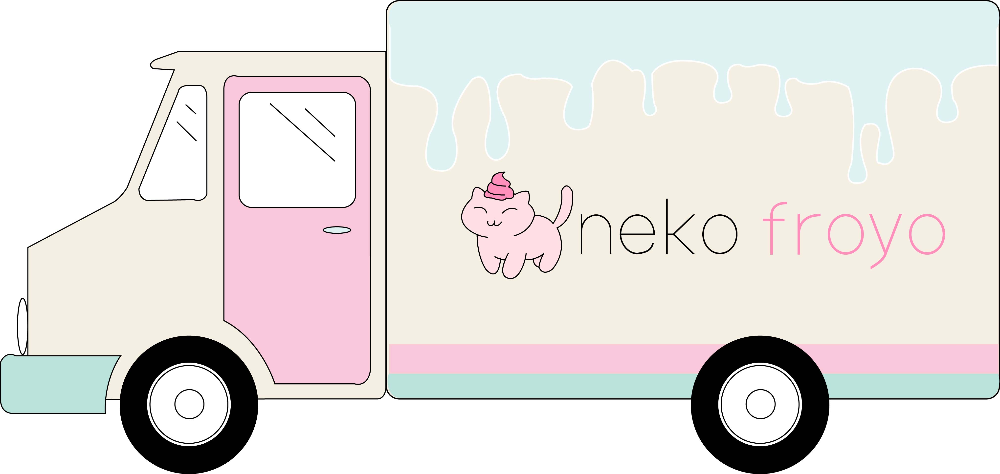

    
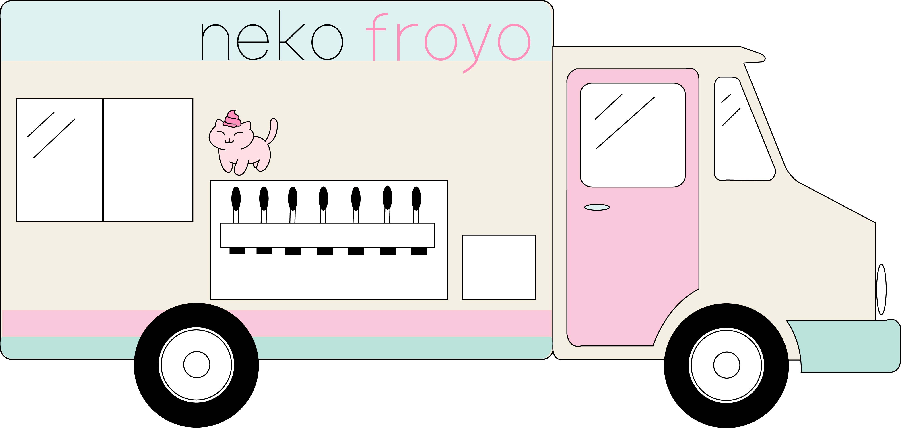

  

The task for this individual project was to create a fictional food truck business and use create designs for the following:
 - 2 sides of a food truck
 - stationary (2-sided business card, envelope, letterhead)
 - 2 sides of a menu
 - menu poster
 - magazine advertisement
 - uniforms
 - 2 additional items

I decided to name my food truck Neko Froyo which sells frozen yogurt. The two additional items I decided to make was the froyo cup design and sticker. For this project, I utilized graphic design principles learned throughout the year including good practices for logo and stationary design, and how to create a memorable brand. This project gave me the opportunity to work on my time management skills because the only time to work on it was class time, and there were so many parts to complete. Throughout this project, I also learned a lot about project planning because you needed to have a good idea about what you wanted to do early on so the designs stayed consistent. For instance, the logo, color palette, and fonts needed to be uniform so you had to make decisions with the intent it would work well with every item you were creating.

  

    
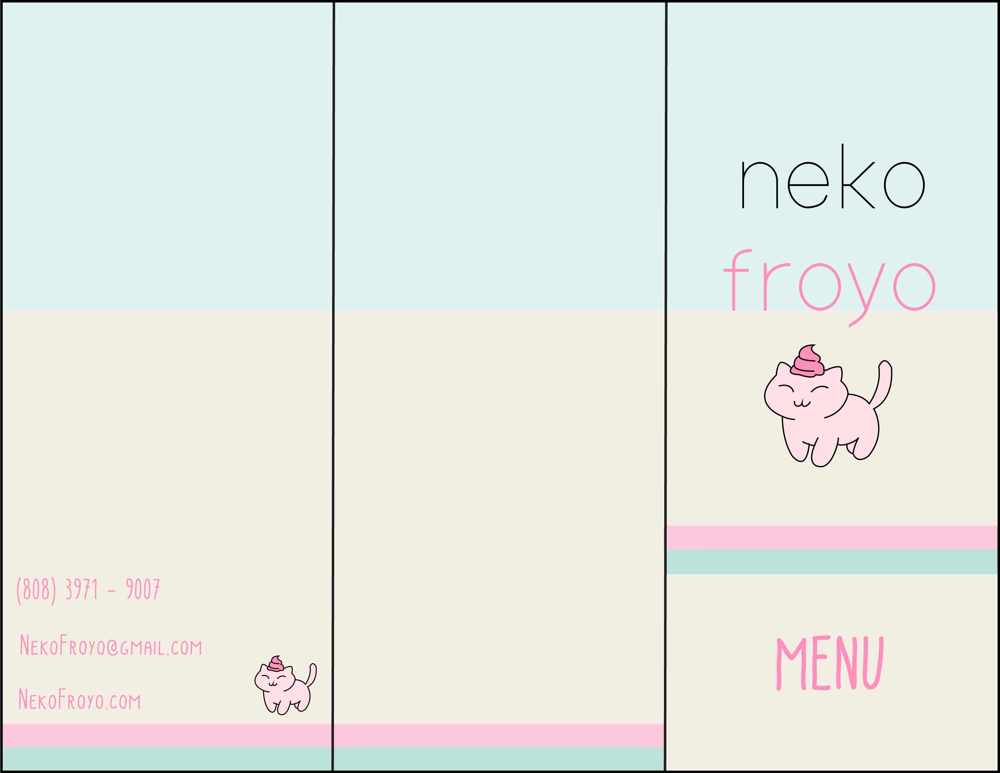

    
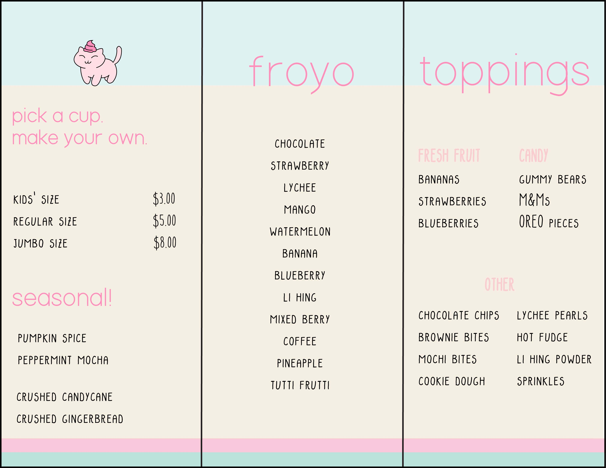

  

  

    
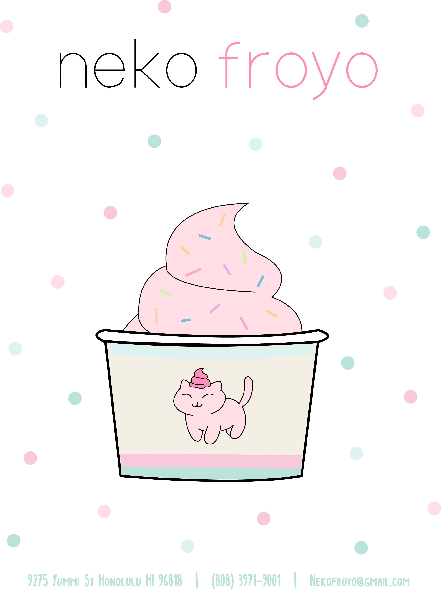

    
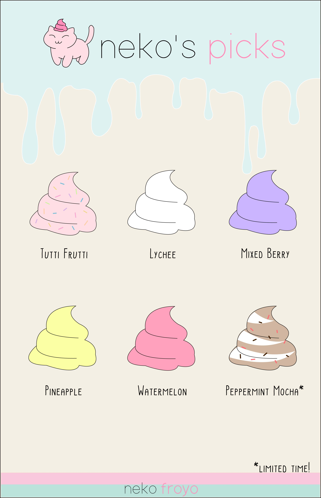

    
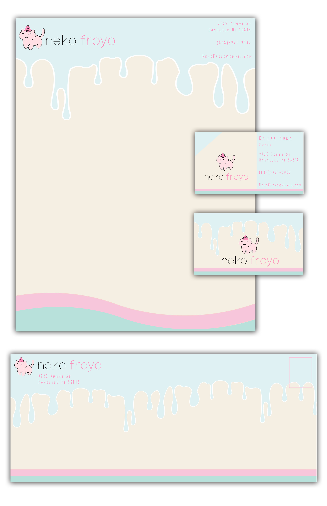

  

  

    
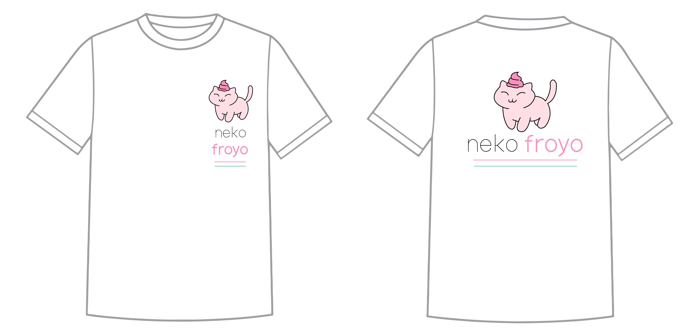

    
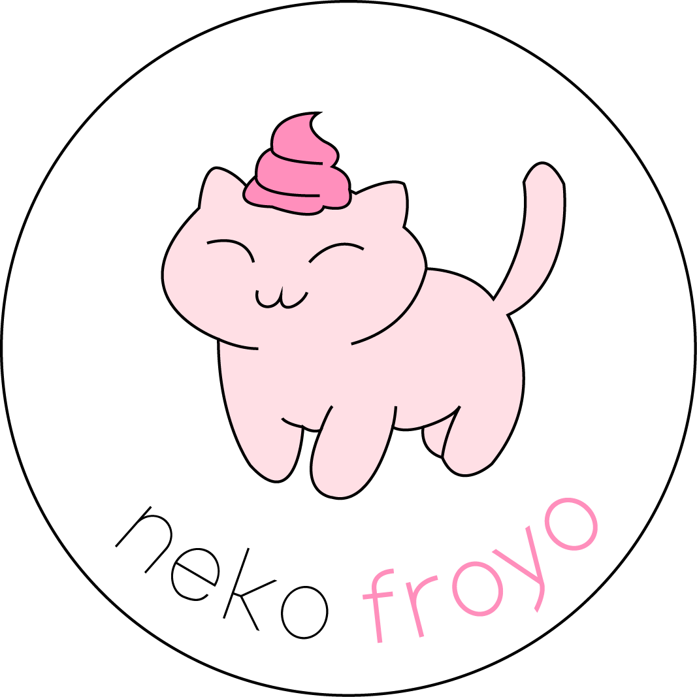

    
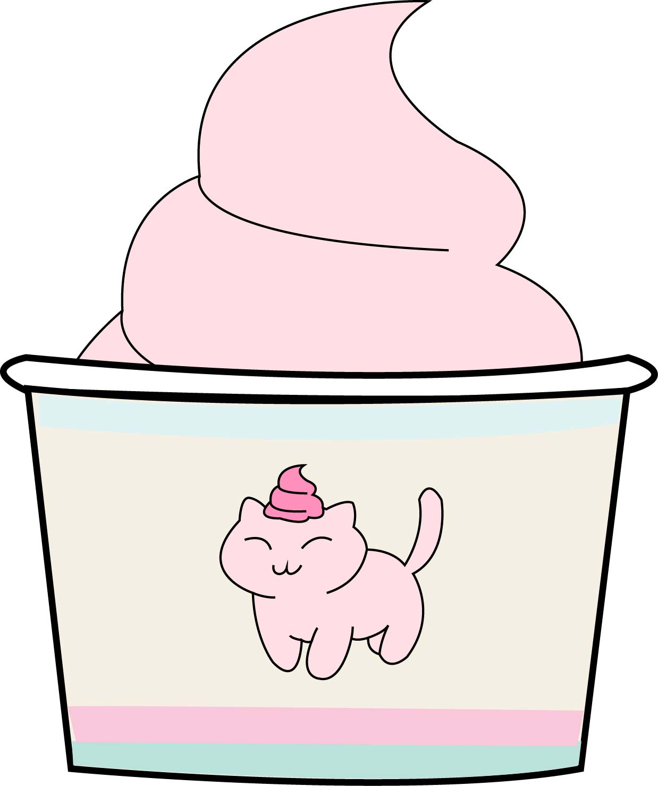

  

In addition, the stationary set consisting of the business card, envelope, and letterhead designs were entered into and won silver at the 2019 High School Pele Awards and 3rd Place at the Hawaii High School Graphics Exhibition.

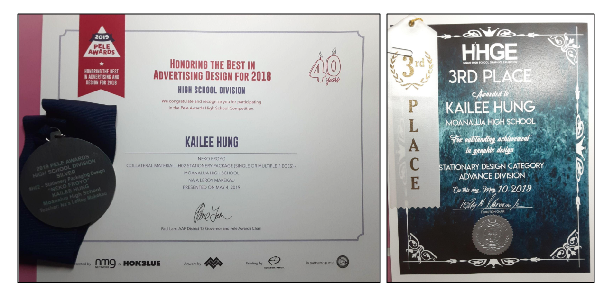

  
