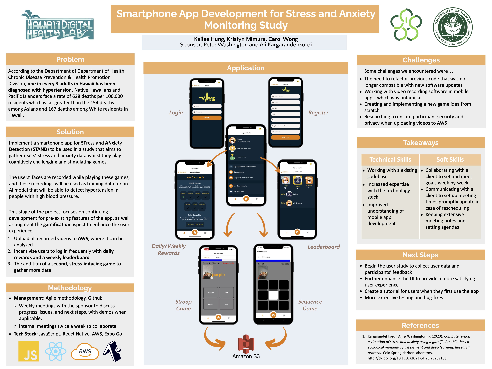

## Overview

STAND is a smartphone application to monitor stress and anxiety through playing games for the purpose of being used in a research study. For our ICS 496 capstone project, we were split into teams and paired up with a sponsor to work on a project for a semester. We chose this project because none of us had any previous experience with mobile development, and it would be a beneficial learning experience.

Throughout the semester, it was our job to effectively communicate with the sponsor to meet each week for goal-setting and presenting updates. Additionally, we found multiple additional times a week to meet as a team without the sponsor so that we could collborate with each other and ensure that everyone had a clear idea of what the others were doing. Much of the app was already built when we started development on our portion, so it gave us good practice in reading code that was not written by ourselves.

At the end of the semester, we presented the project as a poster for ICS Project Day 2024 (as seen above). 

## My Contributions

As a team, we spent much of the time working on the camera recording feature. This was the most crucial part because without properly getting the data of users' facial expressions, there would be no results.

My specific task was to enhance the gamification aspect by designing and implementing a new game for users to play. This was done in the form of a sequence game, which shows a series of flashing boxes in a grid that the player must then mimic successfully. This is done repeatedly until the end of the 30 second game. The length of the patterns are also random in between a certain range to further increase stress in the user.

  

